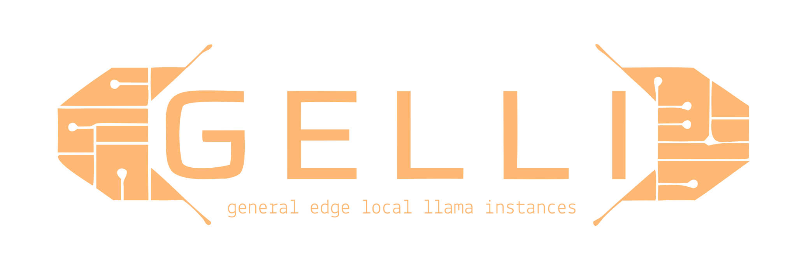

**GELLI** \ˈgel-ē\ ● *proper noun* — *fr Modern English **gel** ("to congeal") fr Old French **gelee** (“to congeal, frost”) fr Latin **gelare** (“to freeze”) fr root **gelū** (“frost”)... ● Also known as the acronymn "Generic Embedded Local Llama Interface"  — but only in marketing for extreme techno-nerds.*

1. A deep freeze container for AI models without the Amazon rainforest in tow...
2. Especially for use with AI in contrained spacces.
3. Easily train LoRAs on your corpus without fuss.
4. Intended to avoid leakage or other AI security mishaps.

### This is a kit for those who loathe Python environments, their dependency dramas, and the emotional toll of debugging pip’s heartbreak. Compile, quantize, bake, and export any AI artifact with the casual flair of a caffeinated shell wizard. There are gotchas (there always are), but nothing like a surprise `pip uninstall torch` at 4am. GELLI generates GGUF, not drama. This is especially for working with  small LLMs and building LoRAs.

```bash
curl -L https://github.com/frinknet/gelli/raw/main/install.sh | sh
```

just install and it will do the rest...
